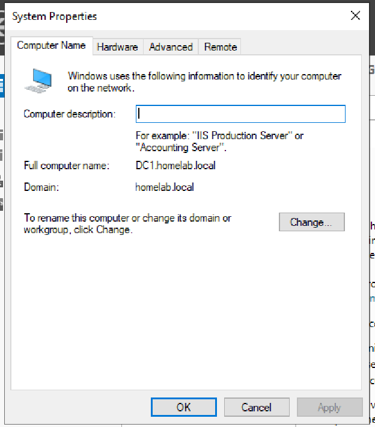
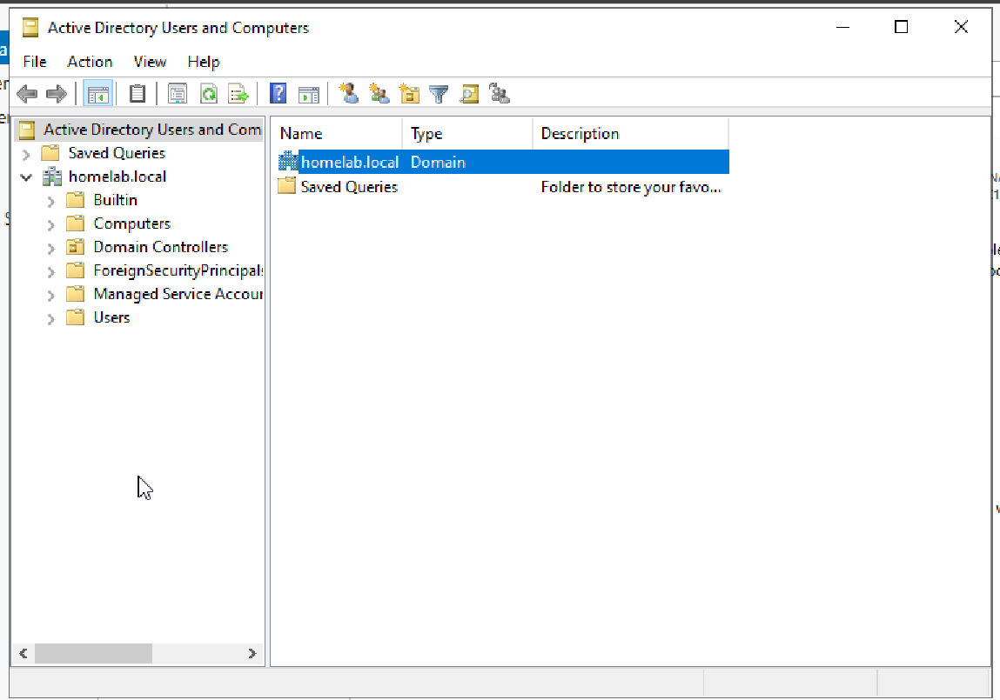
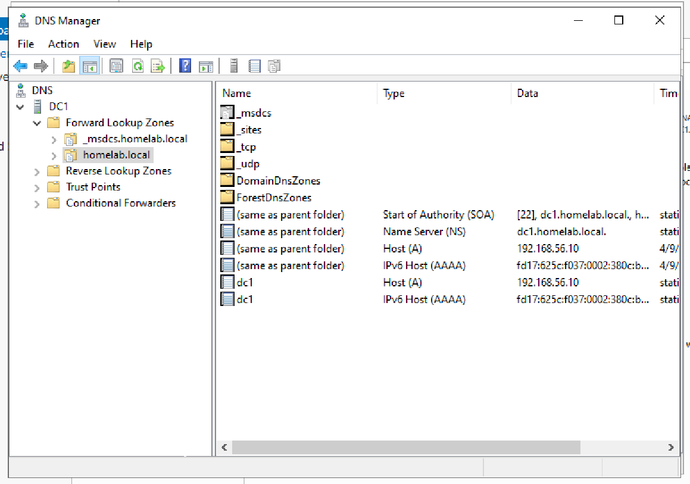
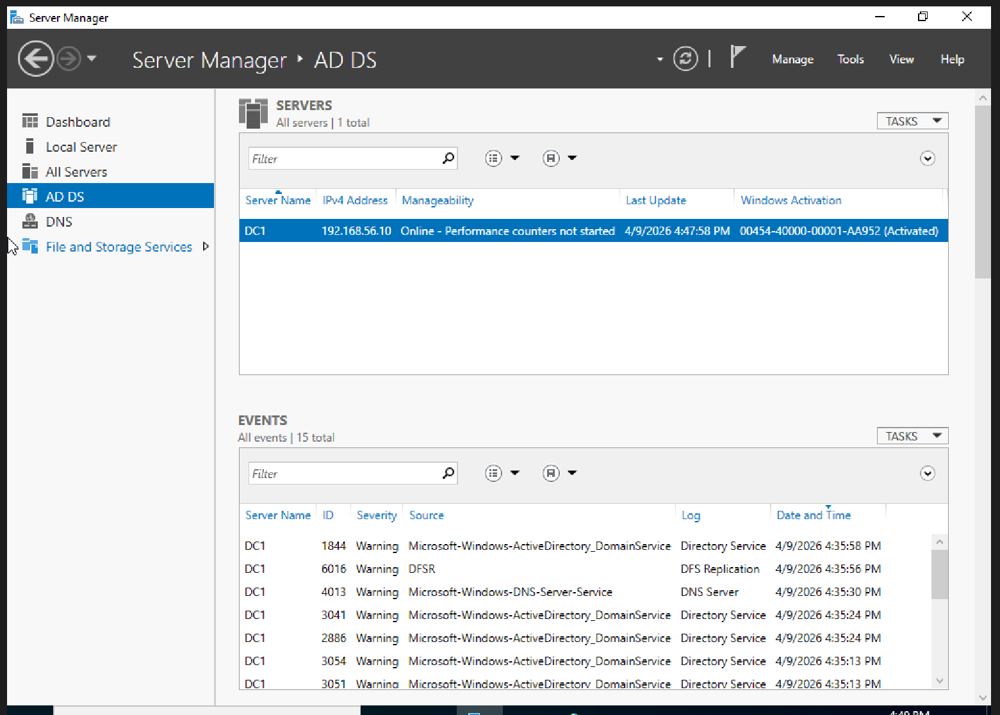

# Active Directory Installation (Home Lab)

## Objective
Set up Active Directory Domain Services (AD DS) on a Windows Server virtual machine and promote the server to a domain controller.

---

## Environment
- Virtualization: Oracle VirtualBox
- Server OS: Windows Server 2022 Evaluation (or 2025)
- VM Name: DC1
- Domain Name: homelab.local

---

## Overview
In this lab, I configured a Windows Server VM to function as a domain controller by installing Active Directory Domain Services and DNS. This establishes a centralized system for managing users, computers, and authentication within a network.

---

## Steps Performed
1. Opened Server Manager
2. Used "Add Roles and Features"
3. Installed:
   - Active Directory Domain Services (AD DS)
   - DNS Server
4. Promoted the server to a Domain Controller
5. Created a new forest:
   - homelab.local
6. Completed installation and rebooted the server
7. Verified successful installation of:
   - Active Directory Users and Computers
   - DNS Manager
   - Server Manager roles

---

## Verification
The following checks confirmed a successful setup:
- Server is joined to domain: homelab.local
- Active Directory Users and Computers console is accessible
- DNS Forward Lookup Zone for homelab.local is present
- AD DS role visible in Server Manager

---

## Screenshots

### Domain Configuration

### Active Directory Users and Computers

### DNS Manager

### Server Manager Dashboard

---

## Issues Encountered
No major issues encountered during installation.

---

## What I Learned
- Active Directory provides centralized user and system management
- Domain Controllers handle authentication and authorization
- DNS is required for proper domain functionality
- AD DS is a core component of enterprise IT environments

---

## Summary
Successfully installed and configured Active Directory Domain Services and promoted a Windows Server VM to a domain controller in a home lab environment. This setup will be used for practicing common IT support tasks such as user management, password resets, and group administration.
