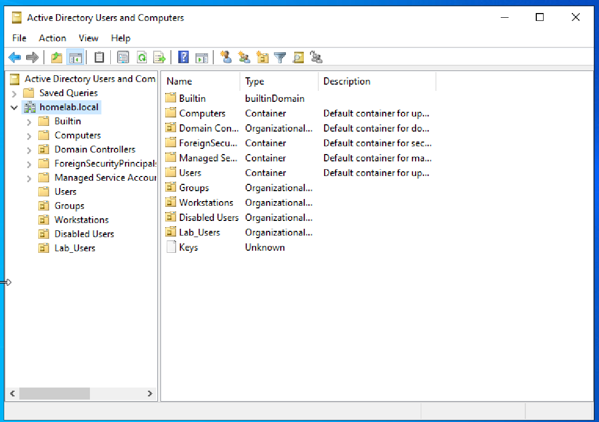
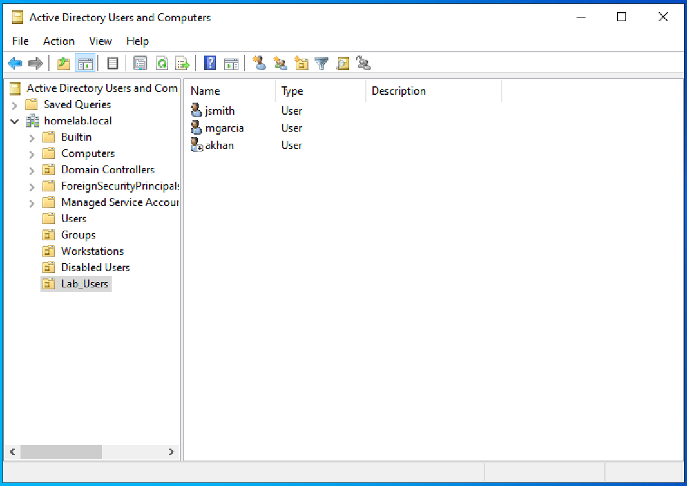
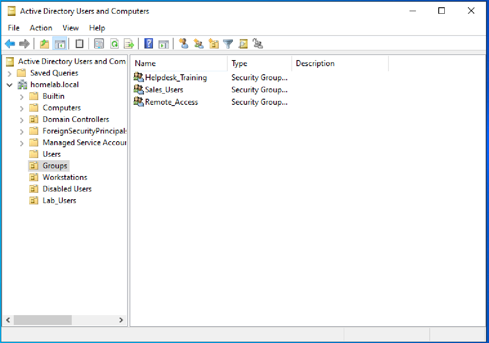
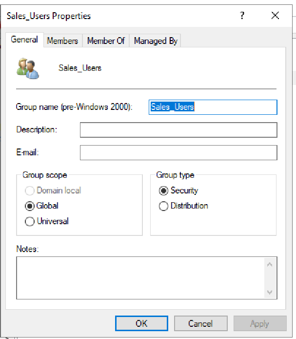
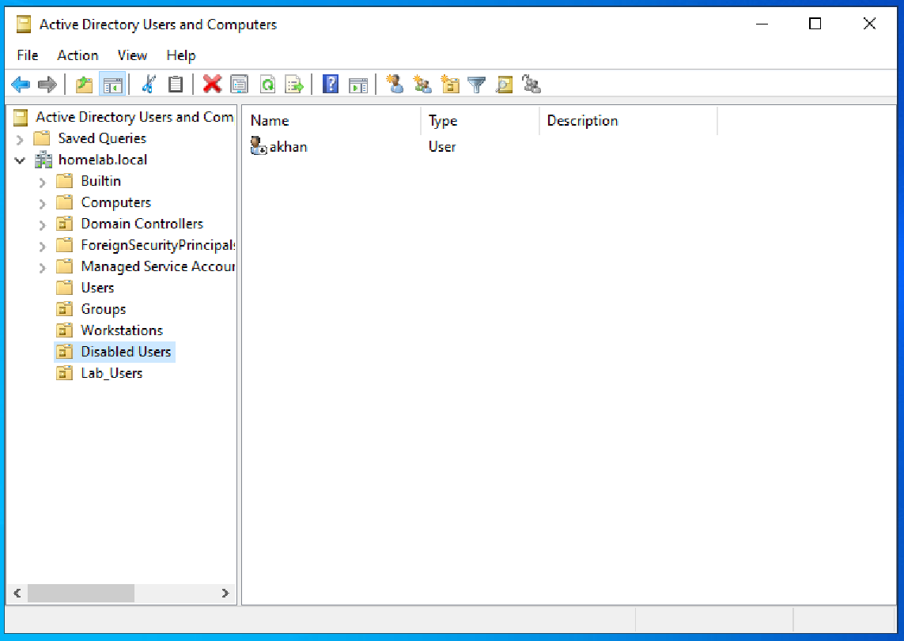
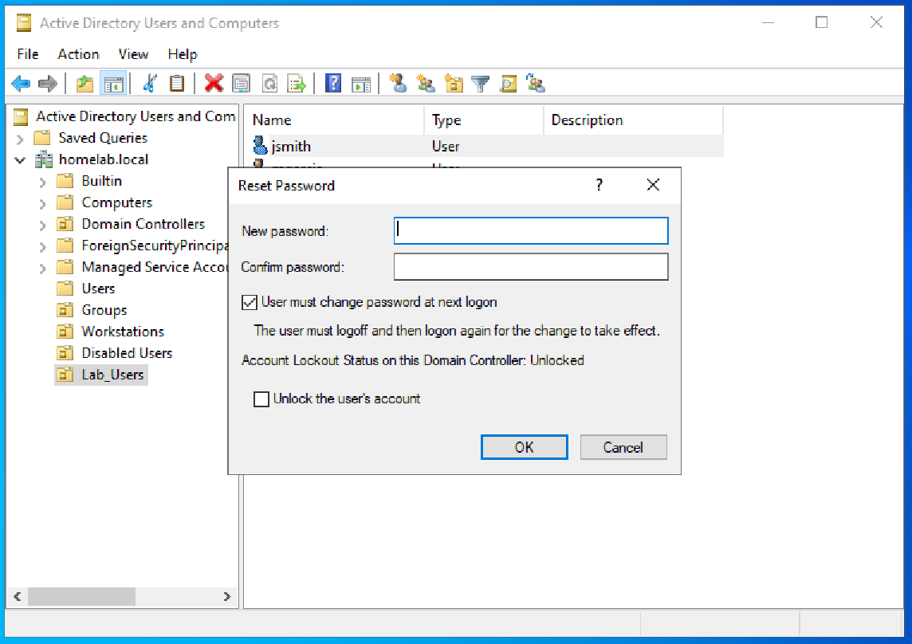

# Active Directory User and Group Management (Home Lab)

## Objective
Practice common Active Directory tasks used in IT support, including user account management, group membership, and basic account troubleshooting.

---

## Environment
- Platform: Windows Server (Domain Controller)
- Tool: Active Directory Users and Computers
- Domain: homelab.local

---

## Overview
In this lab, I simulated common help desk tasks by creating organizational units, users, and groups, and performing routine account management actions. These tasks reflect typical responsibilities in entry-level IT support roles.

---

## Tasks Performed

### Organizational Unit (OU) Setup
Created the following OUs to organize directory objects:
- Users
- Groups
- Workstations
- Disabled Users

---

### User Account Management
Created sample user accounts:
- jsmith
- mgarcia
- akhan

Performed actions:
- Reset user passwords
- Forced password change at next login
- Disabled user accounts
- Moved users between OUs

---

### Group Management
Created security groups:
- Helpdesk_Training
- Sales_Users
- Remote_Access

Performed actions:
- Added users to groups
- Removed users from groups
- Verified group membership via user properties

---

## Verification
The following checks confirmed successful task completion:
- OUs visible and properly structured
- Users created and accessible
- Groups created and populated
- User accounts successfully modified (disabled, moved, password reset)
- Group membership reflected correctly in user properties

---

## Screenshots

### OU Structure

### Users Created

### Groups Created

### Group Membership

### Disabled Account

### Password Reset

---

## Issues Encountered
No major issues encountered during testing.

---

## What I Learned
- Active Directory is used to centrally manage users and permissions
- Organizational Units help structure and control directory objects
- Group-based access simplifies permission management
- Common IT support tasks include password resets, account unlocks, and group assignments

---

## Summary
Successfully practiced core Active Directory user and group management tasks in a home lab environment, simulating real-world help desk scenarios.
