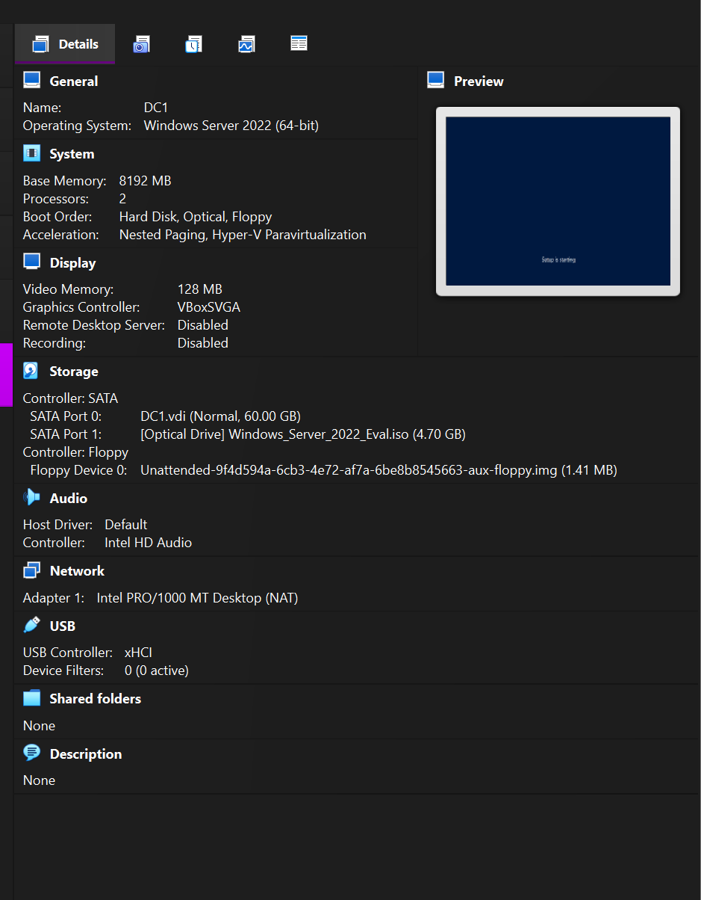
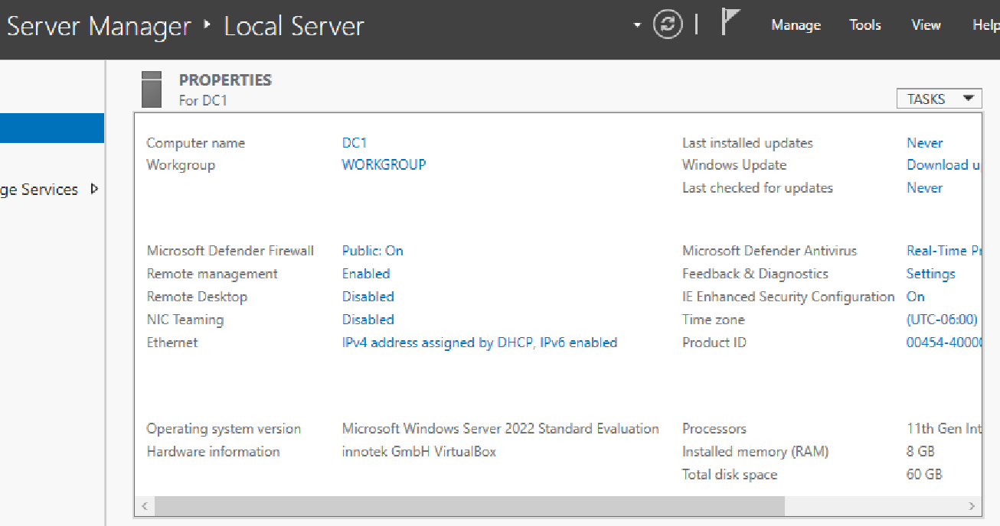
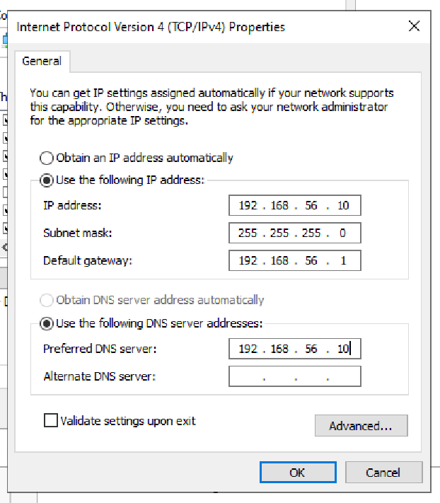

# Windows Server Setup (Home Lab)

## Objective
Create and configure a Windows Server virtual machine to serve as the foundation for an Active Directory environment.

---

## Environment
- Virtualization: Oracle VirtualBox
- Server OS: Windows Server 2022 Evaluation (or 2025)
- VM Name: DC1

---

## Overview
In this lab, I created a Windows Server virtual machine and performed the initial configuration required before installing Active Directory. This includes preparing the system with proper network settings and ensuring the server is ready to function as a domain controller.

---

## Steps Performed
1. Created a new virtual machine in VirtualBox
2. Installed Windows Server using an evaluation ISO
3. Completed initial system setup after installation
4. Assigned a static IP address to ensure consistent network communication

---

## Verification
The following checks confirmed a successful setup:
- Virtual machine configured with appropriate resources (CPU, RAM, storage)
- Windows Server installed and accessible
- Static IP address assigned and retained after reboot

---

## Screenshots

### Virtual Machine Configuration

### Windows Server Installation Complete

### Static IP Configuration

---

## Issues Encountered
No major issues encountered during setup.

---

## What I Learned
- Virtual machines can be used to simulate enterprise environments safely
- Proper server configuration is required before installing Active Directory
- Static IP addressing is important for services like domain controllers

---

## Summary
Successfully created and configured a Windows Server virtual machine, preparing it for Active Directory installation and domain controller promotion.
