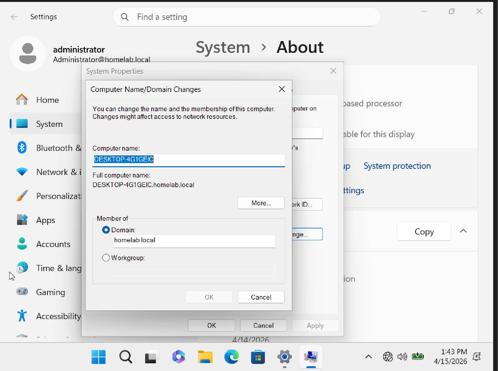
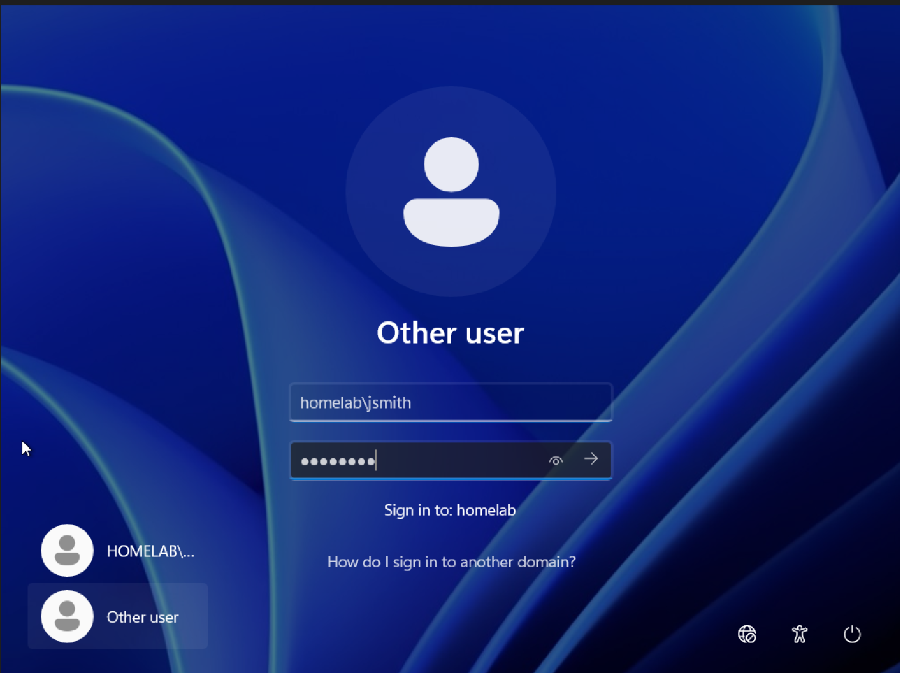
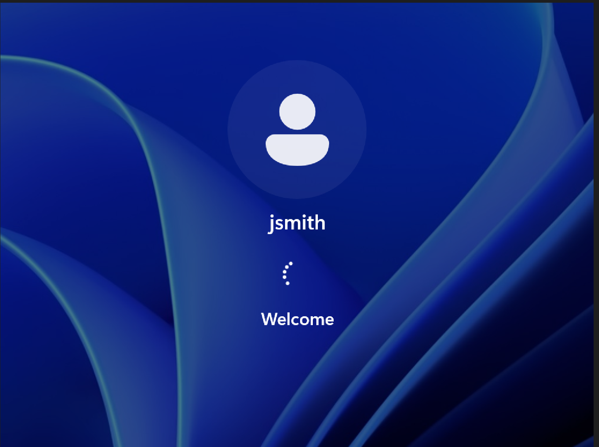

# Domain Join and User Login Testing (Home Lab)

## Objective
Join a Windows client machine to an Active Directory domain and test user authentication scenarios.

---

## Environment
- Domain: homelab.local
- Domain Controller: DC1
- Client Machine: CLIENT1
- Platform: VirtualBox

---

## Overview
In this lab, I created a Windows client virtual machine, joined it to the domain, and tested user login scenarios. This simulates real-world workstation setup and authentication troubleshooting.

---

## Tasks Performed

### Client Setup
- Created Windows client VM
- Installed OS manually
- Created local admin account
- Configured network and DNS

---

### Domain Join
- Joined CLIENT1 to homelab.local
- Authenticated using domain admin account
- Rebooted system

---

### User Login Testing
- Logged in using domain users
- Verified profile creation and login success

---

### Scenario Testing
- Tested disabled account login (failed)
- Tested forced password change
- Verified group membership behavior after login

---

## Verification
- Client joined to domain successfully
- Domain login available
- Users authenticated via AD
- Account restrictions enforced correctly

---

## Screenshots

### Domain Joined

### Login Screen

### User Login Success

### Disabled Account Failure

---

## Issues Encountered
No major issues encountered during setup and testing.

---

## What I Learned
- Domain join connects a client to centralized authentication
- DNS is critical for domain communication
- User login behavior depends on account status and policies
- Login issues are commonly related to DNS or account configuration

---

## Summary
Successfully joined a Windows client to an Active Directory domain and tested real-world user authentication scenarios in a home lab environment.
