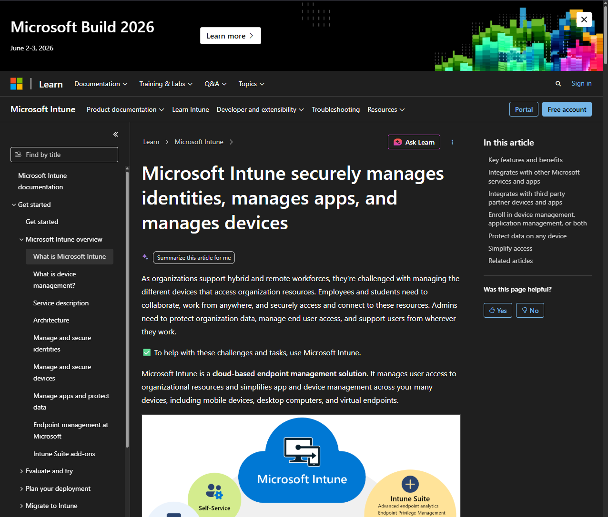
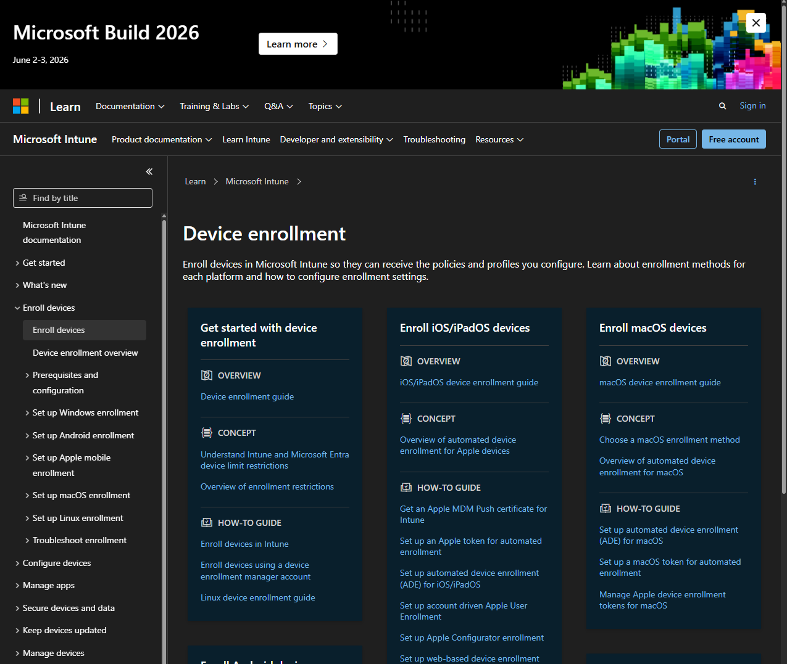
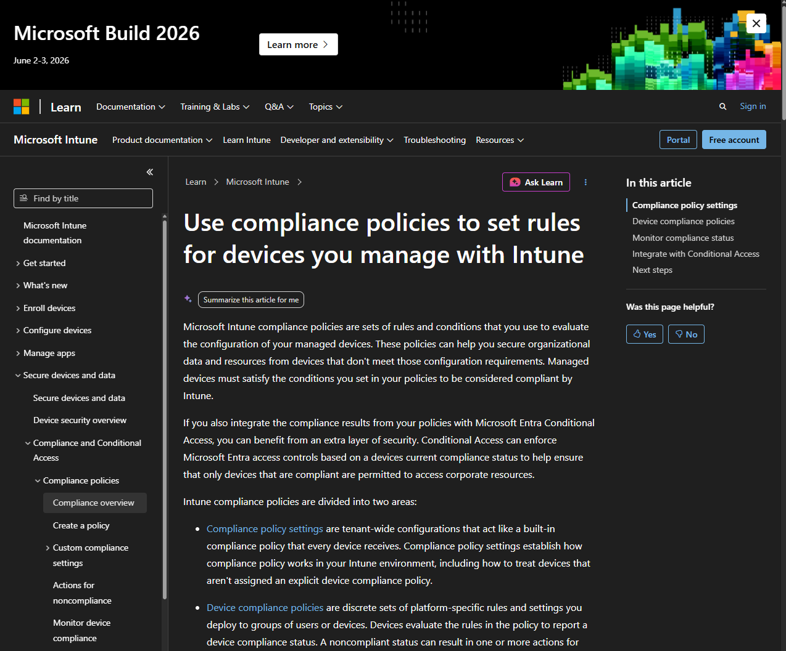
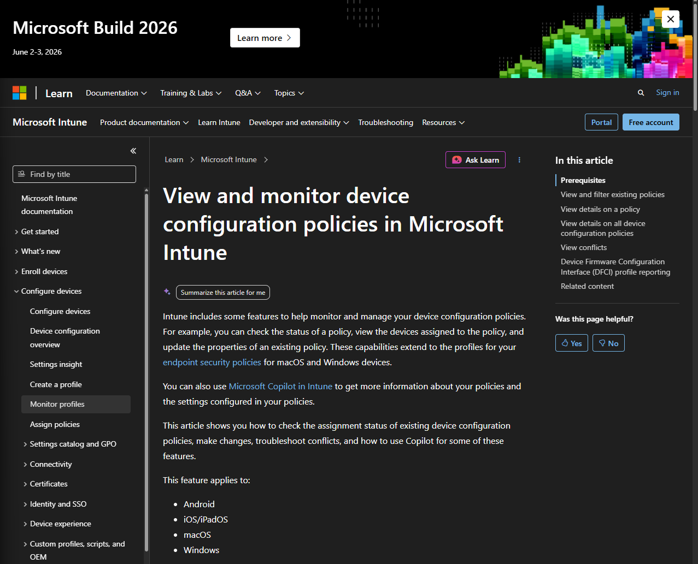
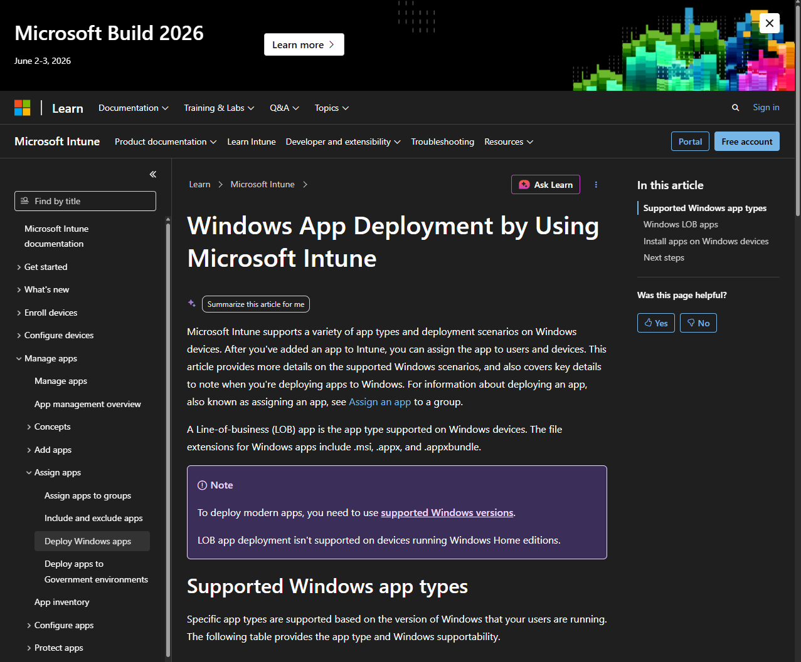
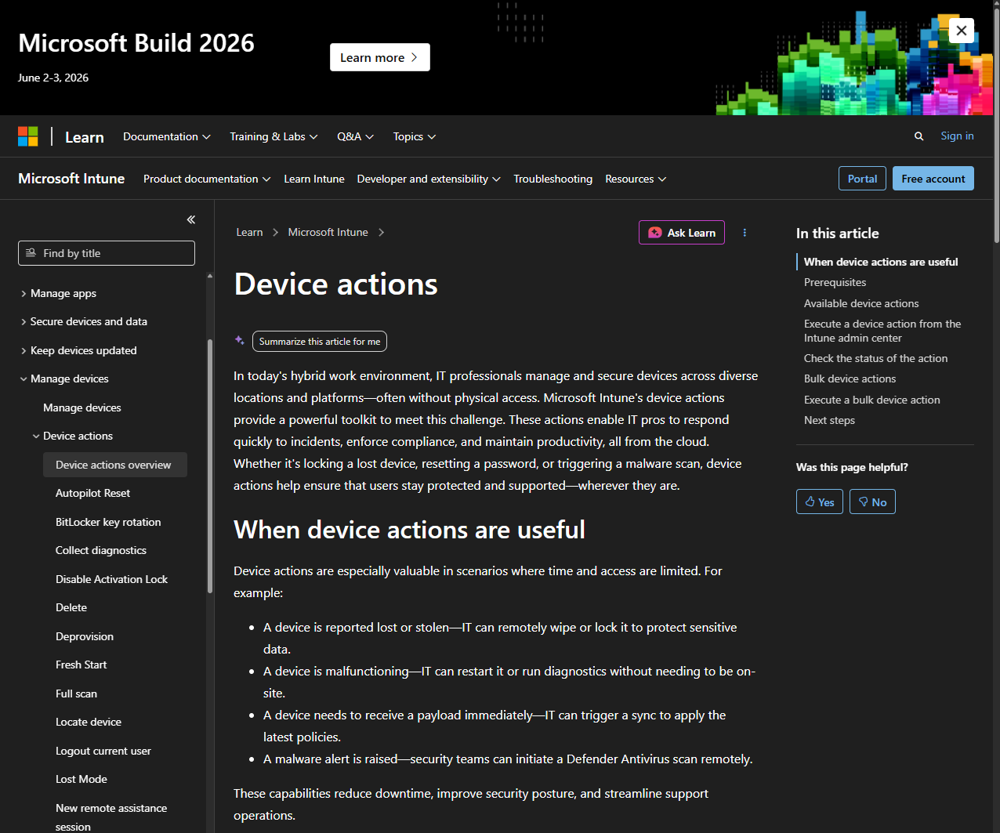
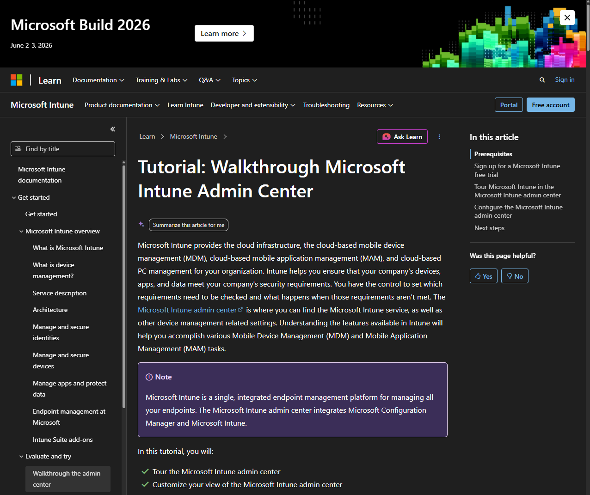

# Intune Basics and Device Management (Documentation Lab)

## Objective
Learn foundational endpoint management concepts using official Microsoft documentation after Microsoft Developer Program sandbox access was unavailable.

---

## Why Documentation Route Was Used
Microsoft Developer Program sandbox access was unavailable due to current eligibility restrictions.

Rather than skipping endpoint management training or overstating hands-on experience, this lab used official documentation, walkthrough resources, and personal notes to build honest knowledge of modern endpoint management workflows.

---

## Environment
- Microsoft Learn Documentation
- Browser-based research
- YouTube platform walkthroughs
- Documentation-based home lab notes

---

## Overview
This documentation lab focused on understanding modern endpoint management workflows commonly used in enterprise IT environments through Microsoft Intune.

The lab focused on:

- Device enrollment
- Compliance management
- Configuration management
- Application deployment
- Remote device actions
- Common endpoint support scenarios

---

## Endpoint Management Concepts Reviewed

### Device Enrollment
Device enrollment is the process of registering a device into company management.

This allows IT teams to manage:

- Company laptops
- Employee mobile devices
- Tablets
- BYOD hardware

Common enrollment scenarios include:

- New employee laptop deployment
- Corporate phone setup
- Replacement device setup
- BYOD enrollment

---

### Compliance Policies
Compliance policies determine whether a device meets company security requirements.

Common requirements include:

- Password enabled
- Device encryption enabled
- Antivirus enabled
- Operating system updates installed
- Screen lock requirements

If a device becomes non-compliant:

- Email access may be blocked
- Company applications may be restricted
- Users may be required to remediate the issue

---

### Configuration Profiles
Configuration profiles allow IT teams to remotely push settings to devices.

Examples include:

- Wi-Fi settings
- VPN settings
- Security settings
- Password policies
- Browser restrictions

---

### Application Deployment
Microsoft Intune allows IT teams to remotely deploy software to devices.

Examples include:

- Microsoft Teams
- Microsoft Office
- VPN clients
- Security software
- Company applications

---

### Remote Device Actions
IT administrators may remotely perform actions such as:

- Sync device
- Restart device
- Retire device
- Wipe device
- Remove company data

These actions are commonly used when devices are lost, replaced, or offboarded.

---

## Example New Employee Device Deployment Workflow

1. Prepare new laptop
2. Enroll device into Intune
3. Apply compliance policies
4. Push required applications
5. Apply configuration profiles
6. Verify user login access
7. Deliver device to employee

---

## Common IT Support Endpoint Issues

### Device Not Compliant
User cannot access company resources due to failed compliance checks.

Example help desk action:
- Review compliance failure reason
- Guide user through updates
- Confirm device returns to compliant state

---

### New Device Enrollment Issue
User receives new laptop but device enrollment fails.

Example help desk action:
- Verify enrollment requirements
- Confirm user licensing
- Retry enrollment process

---

### Missing Application
User is missing required software.

Example help desk action:
- Verify app assignment
- Sync device
- Confirm installation completion

---

### Lost Device
Employee reports lost company phone or laptop.

Example help desk action:
- Verify ownership
- Secure company data
- Initiate remote wipe if necessary

---

### Device Replacement
Employee receives replacement hardware.

Example help desk action:
- Retire old device
- Enroll replacement device
- Reapply required settings/apps

---

## Documentation Reviewed

### Intune Overview Documentation
Reviewed how Intune manages devices in enterprise environments.

---

### Device Enrollment Documentation
Reviewed how devices are registered into management.

---

### Compliance Policy Documentation
Reviewed how organizations enforce device security standards.

---

### Configuration Profile Documentation
Reviewed how settings are deployed remotely.

---

### Application Deployment Documentation
Reviewed how software is distributed to devices.

---

### Remote Actions Documentation
Reviewed how administrators manage devices remotely.

---

## Screenshots

### 1. Microsoft Learn Overview
Official Intune overview documentation used as the starting point.

---

### 2. Device Enrollment Documentation
Official documentation covering how devices are enrolled into management.

---

### 3. Compliance Policies Documentation
Official documentation covering compliance requirements.

---

### 4. Configuration Profiles Documentation
Official documentation covering device configuration deployment.

---

### 5. Application Deployment Documentation
Official documentation covering app deployment workflows.

---

### 6. Remote Actions Documentation
Official documentation covering remote management actions.

---

### 7. Intune Walkthrough Video
Video walkthrough showing the admin interface layout.

---

## What I Learned
- Intune manages modern endpoint devices remotely
- Device enrollment brings hardware under company management
- Compliance policies help enforce security standards
- Configuration profiles automate device setup
- Applications can be remotely deployed
- Remote actions help secure lost or retired devices
- Endpoint management differs from traditional on-prem Active Directory workflows

---

## Summary
Completed an endpoint management documentation lab using official Microsoft documentation after sandbox access restrictions prevented hands-on tenant access.

This lab covered modern device management concepts, common support workflows, and realistic endpoint administration scenarios while keeping portfolio documentation honest and recruiter-safe.
