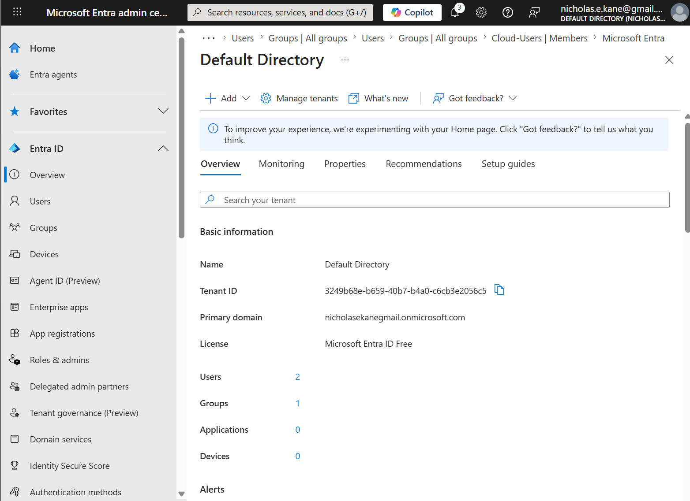
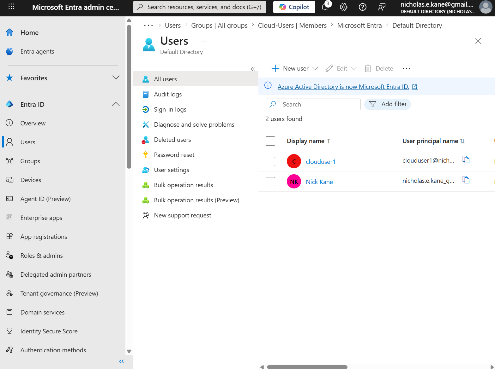
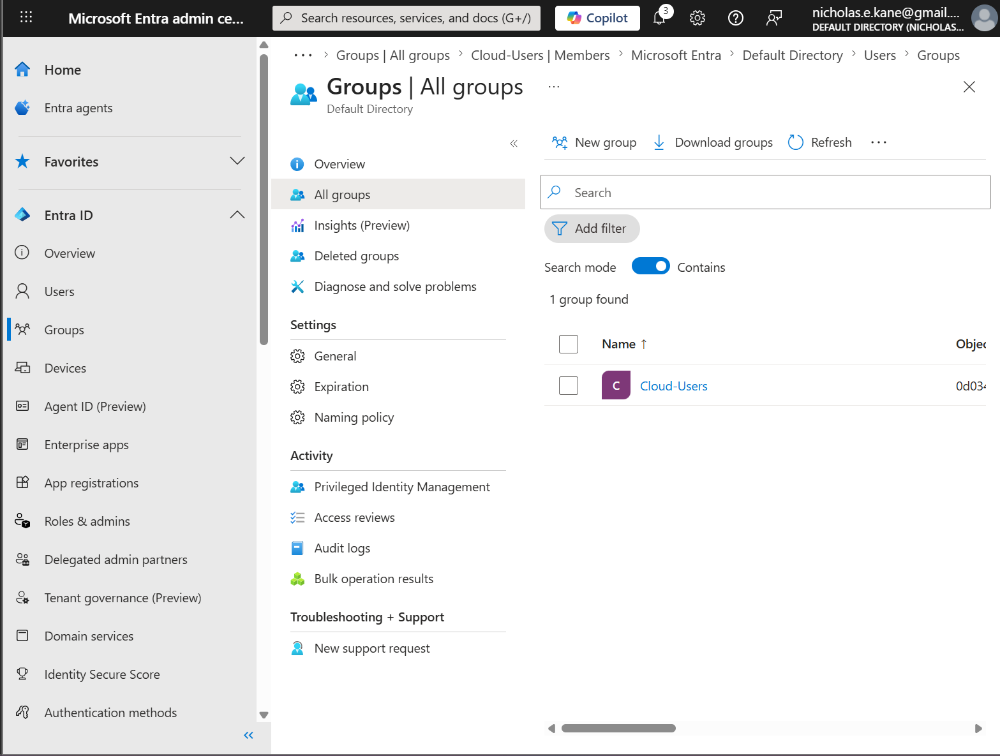
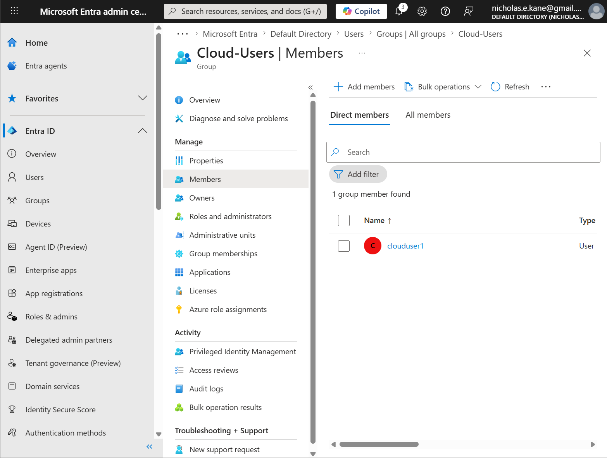

# Microsoft 365 and Entra ID Overview (Home Lab)

## Objective
Understand Microsoft 365 and Entra ID concepts and gain hands-on exposure to cloud-based identity management.

---

## Overview
In this lab, I explored Microsoft Entra ID and Microsoft 365 concepts to understand how cloud-based identity and user management works alongside Active Directory environments.

---

## Environment
- Platform: Microsoft Entra ID (Default Directory)
- Local Lab: Active Directory (DC1, homelab.local)

---

## Tasks Performed

### Entra Tenant Usage
- Used existing Default Directory tenant
- Accessed Entra admin center

---

### User and Group Management
- Created a cloud user account
- Created a group
- Added user to group
- Compared cloud users to local AD users

---

### Identity Exploration
- Reviewed authentication and identity settings
- Explored available security options

---

## Local vs Cloud Comparison

### Local Active Directory
- Users created on domain controller
- Authentication handled locally
- Login occurs on domain-joined machines

### Entra ID (Cloud)
- Users created in cloud directory
- Authentication handled via Microsoft identity platform
- Access can apply across multiple services

---

## Screenshots

### Entra Dashboard

### Users Page

### Groups Page

### User in Group

---

## What I Learned
- Modern IT environments use both local and cloud identity systems
- Entra ID manages authentication and access in cloud environments
- User and group management concepts are similar between AD and Entra
- Understanding both systems is important for IT support roles

---

## Summary
Gained foundational understanding of Microsoft Entra ID and Microsoft 365 identity concepts, including hands-on user and group management in a cloud-based environment.
