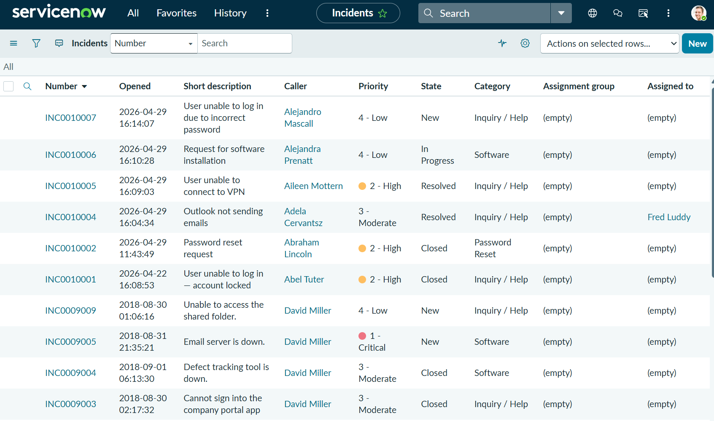
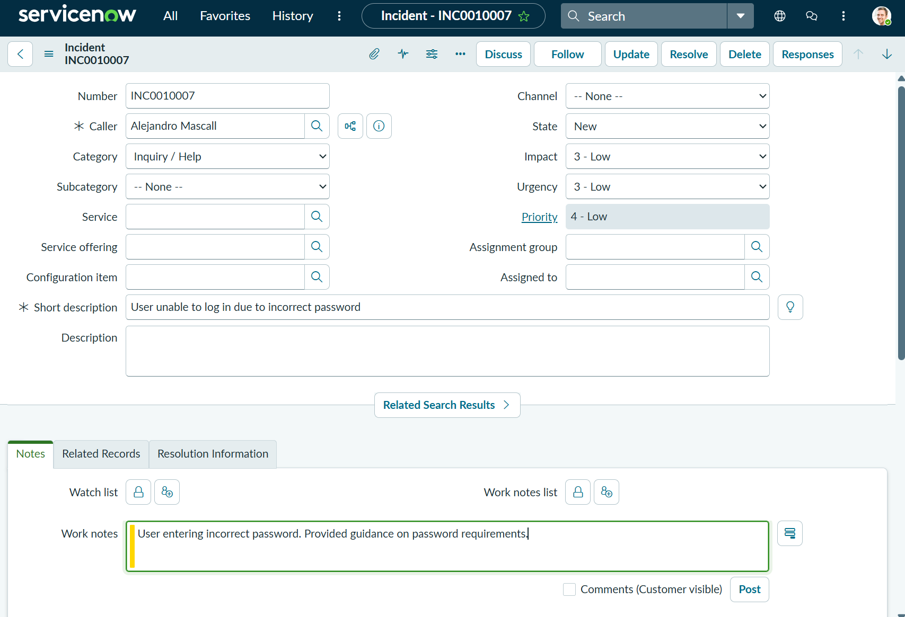
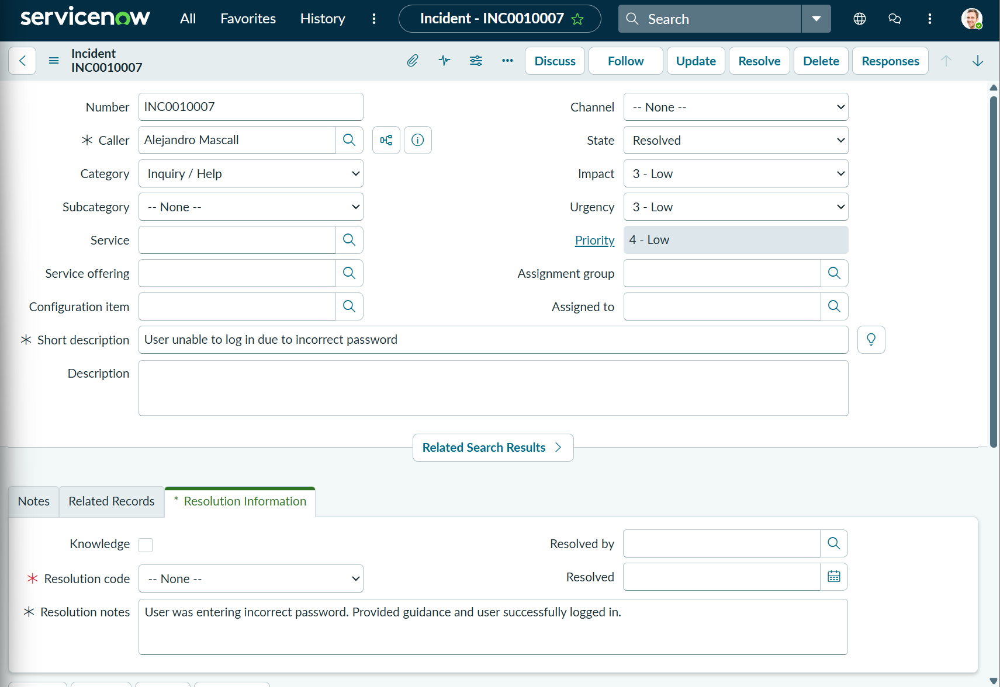
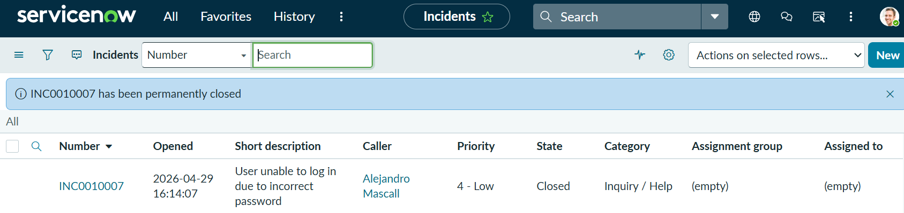

# ServiceNow Incident Lifecycle Practice (Home Lab)

## Objective
Practice full incident lifecycle including priority assignment, documentation, and resolution handling.

---

## Environment
- ServiceNow Personal Developer Instance
- Admin (Platform View)

---

## Overview
Simulated real-world IT support scenarios by creating and managing incidents from creation to closure using proper help desk workflows.

---

## Incident Lifecycle
- New
- In Progress
- Resolved
- Closed

---

## Priority Usage
- 2 – High → User blocked from working
- 3 – Moderate → Standard issue
- 4 – Low → Minor request or non-urgent

---

## Resolution Code Usage
- Solution Provided → Issue fixed
- User Error → Issue caused by user mistake
- Workaround Provided → Temporary fix

---

## Tickets Created

### Account Lockout
- Priority: High
- Resolution Code: Solution Provided

### Password Reset
- Priority: Moderate
- Resolution Code: Solution Provided

### Outlook Issue
- Priority: Moderate
- Resolution Code: Solution Provided

### VPN Issue
- Priority: High
- Resolution Code: Solution Provided

### Software Installation
- Priority: Low
- Resolution Code: Solution Provided

---

## Screenshots

### Incident List (Incident → All)

---

### New Incident Form (Creating Ticket)

---

### Incident Detail (Opened Ticket)

---

### Work Notes Added

---

### Resolved Ticket (State = Resolved)

---

### Closed Ticket (Final State)

---

## What I Learned
- How to manage incidents from creation to closure
- How to assign realistic priority levels based on impact
- How to properly document work notes and resolution steps
- How to apply correct resolution codes in ServiceNow

---

## Summary
Completed full incident lifecycle simulation in ServiceNow, including ticket creation, prioritization, troubleshooting, resolution, and closure using real-world help desk practices.
