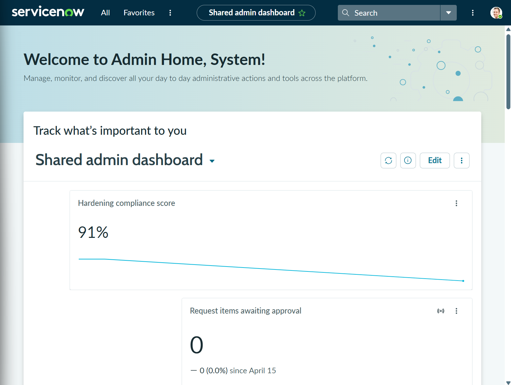
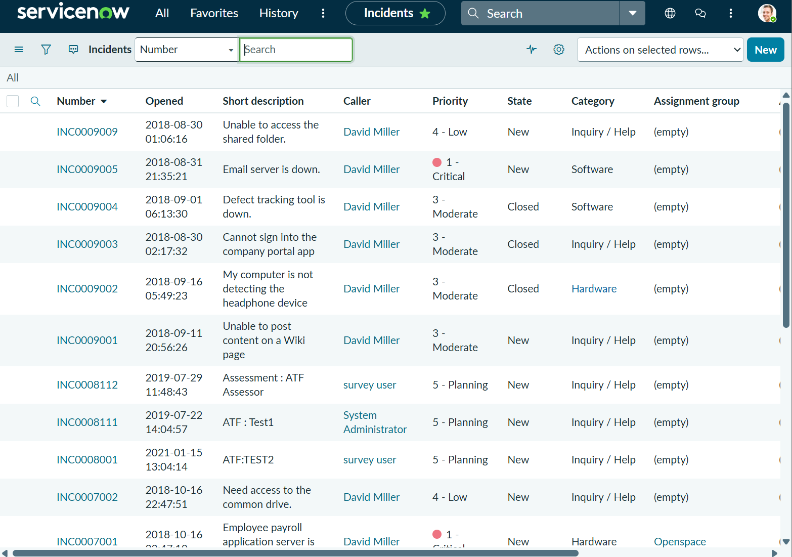
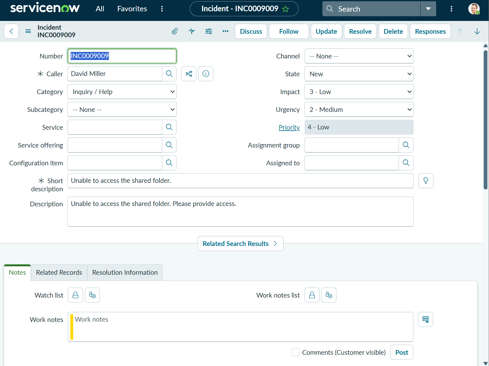
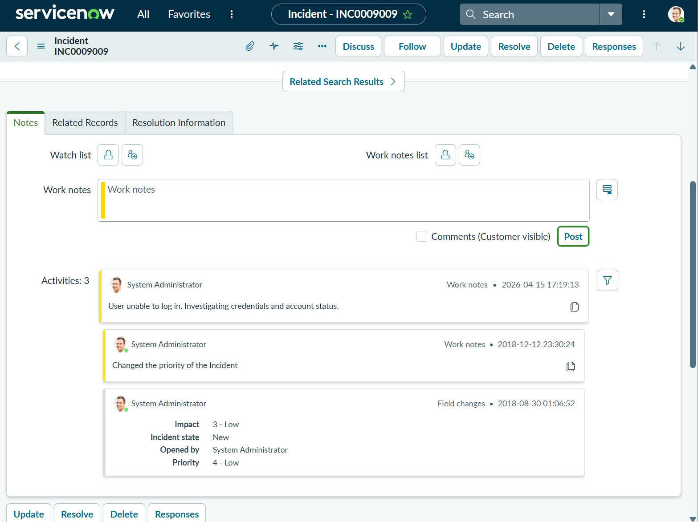

# ServiceNow Instance Setup and Navigation (Home Lab)

## Objective
Set up a ServiceNow developer instance and explore core ticketing workflows used in IT support, including incident management, navigation, and documentation.

---

## Overview
In this lab, I created a ServiceNow developer account, launched a personal developer instance (PDI), and explored the platform interface using the admin (platform) view. I navigated incident records, reviewed ticket structure, and performed basic ticket updates to simulate real-world help desk tasks.

---

## Environment
- Platform: ServiceNow Developer Instance  
- Instance Type: Personal Developer Instance (PDI)  
- Interface Used: Platform / Admin View (not Self-Service Portal)

---

## Key Concept: Platform vs Self-Service

### Platform / Admin View (Used in this Lab)
- Used by IT support and administrators
- Allows:
  - Viewing and updating tickets (incidents)
  - Managing users and groups
  - Adding work notes and resolution details

### Self-Service Portal (Not Used)
- Used by end users to submit requests
- Does not allow ticket management

All lab tasks and screenshots were completed using the Platform/Admin view.

---

## Tasks Performed

### 1. Instance Setup
- Created ServiceNow developer account via developer portal
- Selected:
  - Guided experience (non-developer path)
  - IT Admin role for onboarding
- Requested and launched personal developer instance (PDI)
- Logged into instance and accessed Admin Home

---

### 2. Navigation and Exploration
Used the Filter Navigator (left sidebar search) for all navigation.

#### Modules Accessed
- Incident → All (ticket list)
- Users
- Groups
- Service Catalog (optional)
- Knowledge Base (optional)

---

### 3. Incident Review
- Opened incident records from the Incident → All module
- Reviewed key ticket fields:
  - Incident Number
  - Caller
  - Short Description
  - Priority
  - State (New, In Progress, Resolved)
  - Assignment Group

---

### 4. Basic Ticket Interaction
- Updated ticket state from New → In Progress
- Added internal documentation using Work Notes
- Observed difference between:
  - Work Notes (internal)
  - Additional Comments (user-facing)

---

## Verification
- Successfully accessed ServiceNow developer instance
- Navigated platform using Filter Navigator
- Located and opened incident records
- Reviewed ticket structure and workflow fields
- Updated ticket status and added work notes

---

## Screenshots

### Instance Dashboard (Admin Home)

---

### Incident List (Incident → All)

---

### Incident Detail (Opened Ticket)

---

### Work Notes Added

---

## What I Learned
- ServiceNow is used by IT teams to track and manage support requests through tickets (incidents)
- The Platform/Admin view is required for ticket management, while the Self-Service portal is for end users
- The Filter Navigator is the primary method for accessing modules efficiently
- Tickets contain structured data used to track issue status, ownership, and resolution
- Work Notes are critical for internal documentation and communication within IT teams

---

## Summary
Successfully set up a ServiceNow developer environment and explored core ticketing workflows. Demonstrated the ability to navigate the platform, review incident records, update ticket status, and document work notes in a manner consistent with real-world IT support operations.
