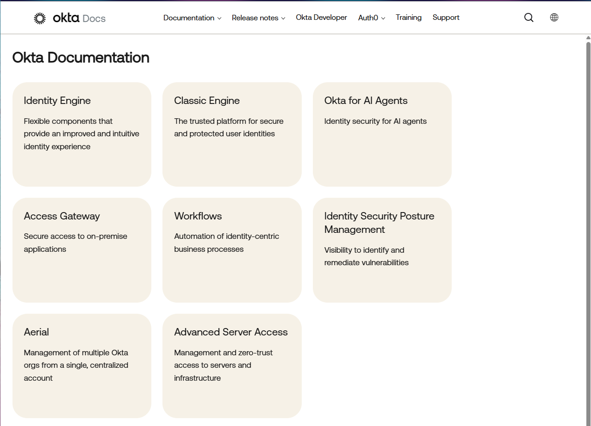
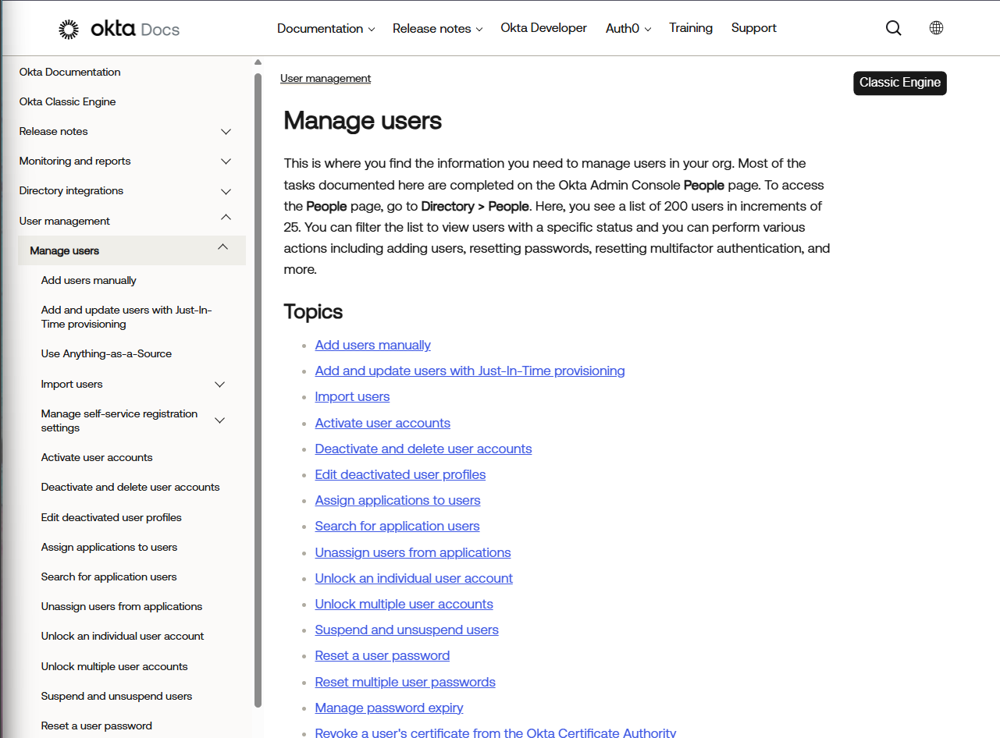
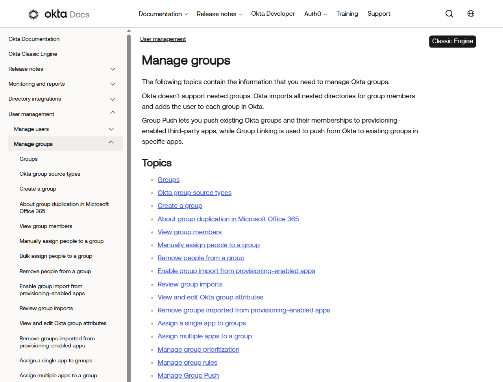
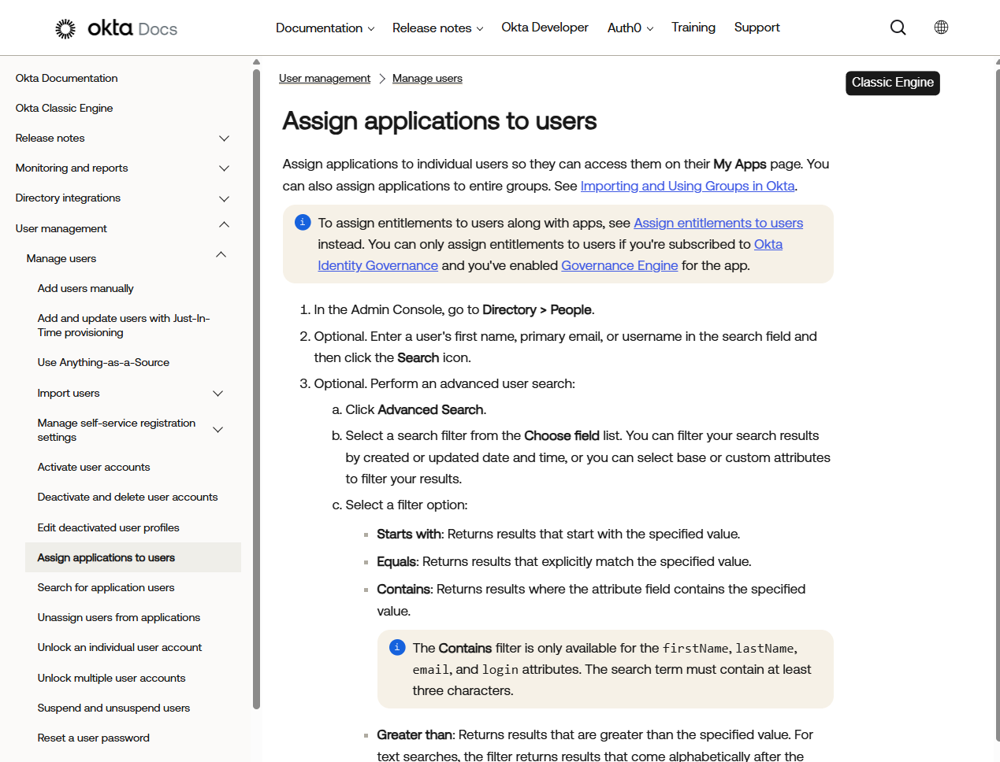
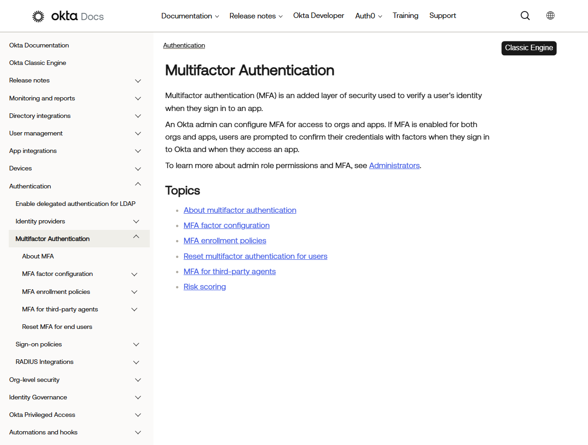
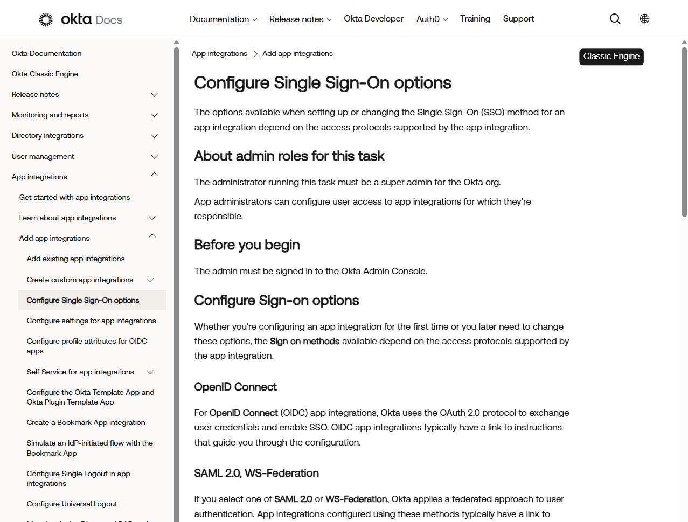

# Okta Identity Fundamentals (Documentation Lab)

## Objective
Learn foundational identity and access management concepts using official Okta documentation after live tenant access was unavailable.

---

## Why Documentation Route Was Used
Okta developer access limitations prevented creation of a usable lab environment.

Instead of skipping identity training or overstating hands-on access, this lab used official Okta documentation to study real IAM workflows and document beginner-level identity administration concepts honestly.

---

## Environment
- Official Okta Documentation
- Browser-based research
- Documentation-based home lab notes

---

## Overview
This documentation lab focused on understanding Okta identity concepts that are common in enterprise IT environments, including users, groups, Single Sign-On, Multi-Factor Authentication, and application assignment workflows.

---

## Identity Concepts Reviewed

### Identity Provider
An identity provider is a platform that manages user authentication and identity information.

In an enterprise environment, an identity provider helps control who can log in and what systems they can access.

---

### Single Sign-On
Single Sign-On allows users to authenticate once and access multiple assigned applications without signing in separately to each one.

This helps reduce password fatigue and simplifies access management.

---

### Multi-Factor Authentication
Multi-Factor Authentication adds an additional verification step beyond a username and password.

Common examples include:
- Authenticator app approval
- One-time verification codes
- Email verification
- SMS verification

---

### Users
Users represent individual employee accounts in an identity platform.

A user account may include:
- Name
- Username
- Email address
- Login status
- Group memberships
- Assigned applications

---

### Groups
Groups are used to organize users and simplify access management.

Instead of assigning every application manually to every person, IT teams can assign access to a group and then add users to that group.

---

### Application Assignments
Application assignments control which users or groups can access specific applications.

This is commonly used during:
- New hire onboarding
- Department changes
- Role changes
- Offboarding

---

## Example Employee Onboarding Workflow

1. Create the user account.
2. Assign the user to the correct department group.
3. Assign required applications through user or group assignment.
4. Require MFA enrollment.
5. Provide login instructions to the user.
6. Verify the user can access required systems.

---

## Common IT Support IAM Issues

### Password Reset
User forgot their password and cannot log in.

Example help desk action:
- Verify user identity
- Initiate password reset
- Confirm successful login

---

### MFA Lockout
User lost access to their authentication device.

Example help desk action:
- Verify user identity
- Reset MFA factor or recovery method
- Require re-enrollment

---

### Missing Application Access
User cannot access an application required for their role.

Example help desk action:
- Confirm user role or department
- Check group membership
- Assign user or group to the application
- Confirm access restored

---

### Account Lockout
User is locked out after multiple failed login attempts.

Example help desk action:
- Verify user identity
- Check account status
- Unlock account if appropriate
- Advise user on correct login process

---

## Documentation Reviewed

### User Management
Reviewed how identity platforms manage user accounts and user profile information.

### Group Management
Reviewed how groups are used to organize users and simplify access control.

### Application Assignment
Reviewed how access to applications can be assigned to users or groups.

### MFA
Reviewed how additional authentication factors improve account security.

### SSO
Reviewed how Single Sign-On allows users to access multiple applications with one authentication session.

---

## Screenshots

### 1. Okta Documentation Homepage
Official Okta documentation homepage used as the starting point for the documentation lab.

---

### 2. User Management Documentation
Official Okta documentation page covering users, people, user profiles, or user management.

---

### 3. Group Management Documentation
Official Okta documentation page covering groups, group membership, or group-based access.

---

### 4. Application Assignment Documentation
Official Okta documentation page covering assigning applications to users or groups.

---

### 5. MFA Documentation
Official Okta documentation page covering MFA, security methods, authenticators, or factor enrollment.

---

### 6. SSO Documentation
Official Okta documentation page covering Single Sign-On, app integrations, or SAML/OIDC SSO concepts.

---

## What I Learned
- Okta is an identity provider used to manage authentication and access.
- SSO allows users to access multiple applications after signing in once.
- MFA improves account security by requiring an additional verification method.
- Groups make access management easier and more scalable.
- Applications can be assigned directly to users or through group membership.
- Common help desk IAM issues include password resets, MFA lockouts, account lockouts, and missing app access.

---

## Summary
Completed an Okta identity fundamentals documentation lab using official Okta documentation after live tenant access was unavailable. This lab covered core IAM concepts, common support workflows, and realistic identity administration scenarios while keeping portfolio documentation honest and accurate.
